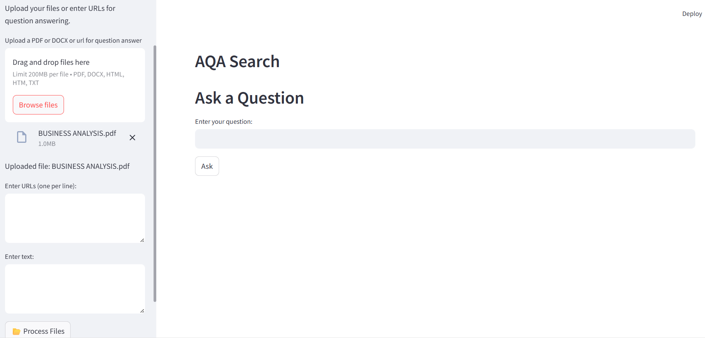

# 🔎 AQA Search - Ask a Question from Your Files (Offline RAG App)

**AQA Search** is a **local Retrieval-Augmented Generation (RAG) application** built using **Streamlit**, **LangChain**, **Ollama**, and **ChromaDB**. This app allows you to upload files, paste URLs (optional), or enter custom text to ask questions and get context-aware answers — all running locally on your machine **without internet**.



---

## 🧠 Features

- 📂 Upload multiple files (PDF, DOCX, TXT, HTML)
- 🌐 Enter URLs (⚠️ available only when hosted online)
- ✍️ Paste your own text for Q&A
- 🧠 Uses local **LLM (via Ollama)** and **embeddings** (`nomic-embed-text`)
- 🔍 Retrieves best context using **ChromaDB**, reranked with **CrossEncoder**
- 📡 No internet or API keys required — 100% offline

---

## 🛠️ Built With

- [Streamlit](https://streamlit.io/)
- [LangChain](https://www.langchain.com/)
- [ChromaDB](https://www.trychroma.com/)
- [Ollama](https://ollama.com/)
- [nomic-embed-text](https://ollama.com/library/nomic-embed-text)
- [LLaMA3 (or other local LLMs)](https://ollama.com/library)

---

## 🚀 How to Run Locally

> ✅ You must have **Ollama** installed and running with required models locally before launching the app.

### 📥 Step 1: Clone the repository

```bash
git clone https://github.com/your-username/your-repo-name.git
cd your-repo-name
📦 Step 2: Install dependencies
bash
Copy
Edit
pip install -r requirements.txt
Or manually:

bash
Copy
Edit
pip install streamlit langchain chromadb sentence-transformers ollama requests unstructured pypdf python-docx html5lib
🤖 Step 3: Start Ollama with required models
bash
Copy
Edit
ollama serve
ollama run llama3
ollama run nomic-embed-text
Replace llama3 with the model name you’re using (e.g., mistral, llama2, etc.)

🚪 Step 4: Run the Streamlit app
bash
Copy
Edit
streamlit run aqa_app.py
Then open your browser and go to: http://localhost:8501

📌 Notes
✅ This app is offline-first and runs fully on your local system using Ollama and ChromaDB.

🌐 The URL-based input works only when deployed online (e.g., Streamlit Cloud, Hugging Face).

🧠 Document embeddings are stored locally in a chroma_db/ folder.

🔮 Future Improvements
🌐 Enable online URL scraping (when deployed)

💾 Export Q&A results as PDF or CSV
🧠 Add memory to track user context
📚 Combine results from multiple files

